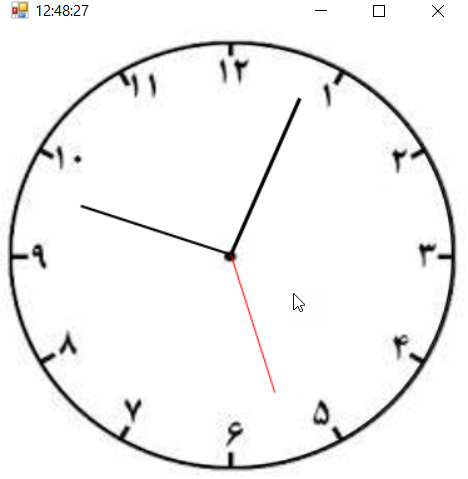

# C# Analog Clock

A simple analog clock application developed using C# and Windows Forms.

The application displays an analog clock with animated hour, minute, and second hands. The position of each hand is calculated using angles, radians, and trigonometric functions.

## Features

- Analog clock display
- Hour hand animation
- Minute hand animation
- Second hand animation
- Real-time clock movement
- Circular coordinate calculations
- Degree to radian conversion
- Use of sine and cosine functions

## Technologies

- C#
- Windows Forms
- .NET
- Visual Studio
- PowerPacks

## Mathematical Concepts

The position of the clock hands is calculated using trigonometric functions.

Degrees are converted to radians using:

```text
radians = degrees × Math.PI / 180

Cartesian coordinates are calculated from polar coordinates using:

x = r × Math.Cos(a)
y = r × Math.Sin(a)

The clock uses these calculations to determine the position of the hour, minute, and second hands.

How to Run
Clone the repository:
git clone https://github.com/Reyhaneh04/CSharp-Analog-Clock.git
Open the .sln file in Visual Studio.
Restore the required NuGet packages if necessary.
Build the project.
Run the application.
Screenshots

Add screenshots of the application here.

Video Demo

A video demonstration of the analog clock is available in this repository.

Project Structure
AnalogClock/
├── 1.csproj
├── App.config
├── Form1.cs
├── Form1.Designer.cs
├── Form1.resx
├── Program.cs
├── Properties/
├── packages.config
└── .gitignore
Project

GitHub Repository:

https://github.com/Reyhaneh04/CSharp-Analog-Clock

## Screenshots


